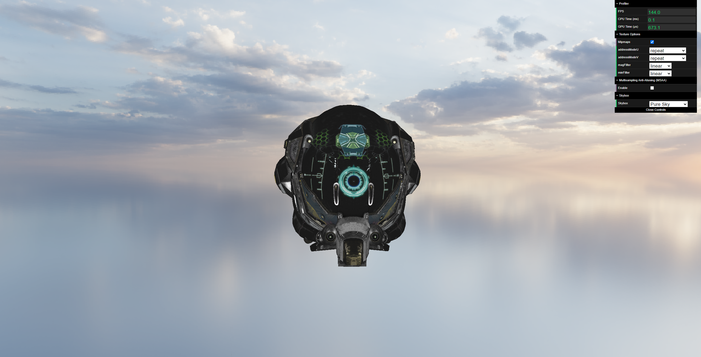

# wgpu-renderer
  
**Physically Based Rendering(PBR)** Pipeline via **TypeScript, WebGPU and Webpack**

## Live Demo
GitHub Page: [https://maoz233.github.io/wgpu-renderer](https://maoz233.github.io/wgpu-renderer)
+ **Tumble**: **Alt + LMB** (Hold *Alt* key and *Left Mouse Button* to rotate camera around target.)
+ **Track**: **Alt + MMB** (Hold *Alt* key and *Middle Mouse Button* to move camera around target.)
+ **Dolly**: **Alt + RMB** (Hold *Alt* key and *Right Mouse Button* to move close to or far away from target.)
## Showcase


## Requirements:
Node version: 20.15.0

## Setup
```bash
git clone git@github.com:maoz233/wgpu-renderer.git
npm install
npm run dev

